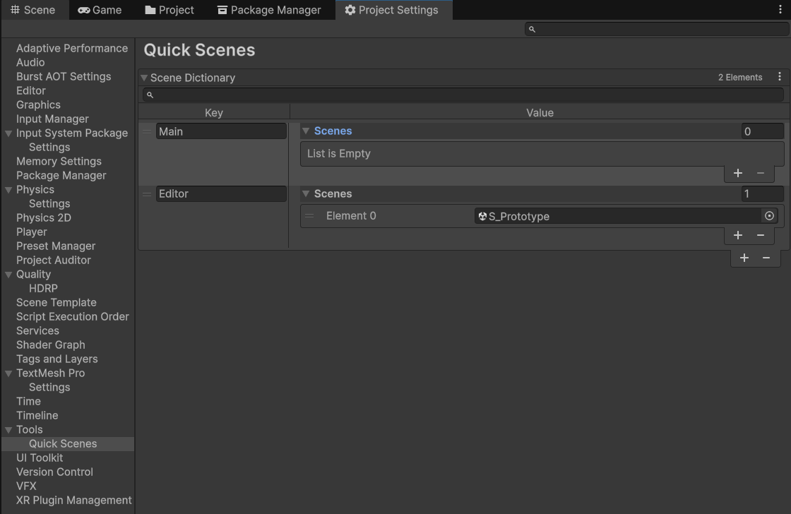

<div align="center">
  
[](https://github.com/mrrobinofficial/unity-quickscenes/blob/HEAD/LICENSE.txt)

</div>

#

<center>
    <p>
        <i>
            Allows you to quickly open scenes from the editor.
        </i>
    </p>
</center>




## ⚙️ Before you begin

* Unity 2022.x and later
* [Serialized Dictionary](https://github.com/MrRobinOfficial/SerializedDictionary)*
* [Easy Project Settings](https://github.com/gilzoide/unity-easy-project-settings)*

> [!CAUTION]
> Required packages are marked with `*`.

### ⚙️ Required Packages

#### Easy Project Settings

This package is available on the [openupm registry](https://openupm.com/)
and can be installed using the [openupm-cli](https://github.com/openupm/openupm-cli):

```
openupm add com.gilzoide.easy-project-settings
```

Otherwise, you can install directly using the [Unity Package Manager](https://docs.unity3d.com/Manual/upm-ui-giturl.html)
with the following URL:

```
https://github.com/gilzoide/unity-easy-project-settings.git#1.1.0
```

### SerializedDictionary (My fork)

You can install directly using the [Unity Package Manager](https://docs.unity3d.com/Manual/upm-ui-giturl.html)
with the following URL:

```
https://github.com/MrRobinOfficial/SerializedDictionary.git
```

## ⚒️ How to Install

This package is available on the [openupm registry](https://openupm.com/) and can be installed using the [openupm-cli](https://github.com/openupm/openupm-cli):

```
openupm add com.mrrobinofficial.quick-scenes
```

Otherwise, you can install directly using the [Unity Package Manager](https://docs.unity3d.com/Manual/upm-ui-giturl.html)
with the following URL:

```
https://github.com/mrrobinofficial/unity-quickscenes.git
```

## 📘 Overview

This package introduces a **custom editor overlay** for Unity that enhances scene management during development. It includes a toolbar button labeled **Scene Selector**, which launches a custom **Search Window Provider**.

The Search Window is context-aware, leveraging a dictionary that maps **group names** (e.g., `"main"` or `"levels"`) to corresponding lists of scenes. This allows developers to organize related scenes under logical groupings and access them quickly.

Scene group definitions are fully configurable via the **Project Settings**.

## 📖 How to Use

1. Open **Project Settings** in Unity.
2. Navigate to **Tools > Quick Scenes**.
3. Define your custom **scene groups** by specifying a group name and assigning one or more scenes to each.
4. Use the **Scene Selector** button in the editor toolbar to activate the overlay and access the grouped scene search window.

> 🔗 The toolbar button uses Unity’s [Editor Overlays](https://docs.unity3d.com/Manual/overlays.html) system.

## 🆘 Support

If you have any questions or issue, just write either to my [YouTube channel](https://www.youtube.com/@mrrobinofficial), [Email](mailto:mrrobin123mail@gmail.com) or [Twitter DM](https://twitter.com/MrRobinOfficial).
